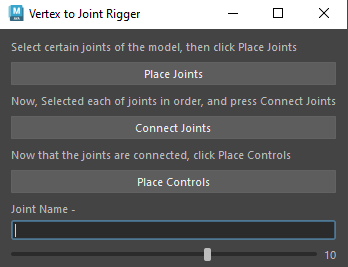

# My Maya Plugins

## Limb Rigger

[Limb Rigger Scirpt]("./src/LimbRigger.py")

this plugin rigs 3 joint limbs with ik and fk blend

* suppoorts auto joint finding, control size, and color picking

## Proxy Generator

[Proxy Generator Script]("./src/ProxyGenerator.py")

this plugin allows for a rigged mesh to be broken down into parts so animators can focus on certain areas

Here how it works - 

```python
class ProxyGenerator:
    def __init__(self):
        self.skin = ""
        self.model = ""
        self.jnts = []
```
^ Main class and constructer that picks up if a rigged model has been selected

```python
def BuildProxyForSelectedMesh(self):
        model = mc.ls(sl=True)[0]
        if not IsMesh(model):
            print(f"{model} is not a mesh!")
            return
```
^ Returns the string - "Model" is not a Mesh!, ensuring that only rigged meshes are to be selected

```python
 self.model = model
        print(f"found model {self.model}")
        modelShape = mc.listRelatives(self.model, s=True)[0]
        skin = GetAllConnectsIn(modelShape, GetUpperStream, IsSkin)
        if not skin:
            print(f"{self.model} is not bound!")
            return
```
^ Checks if the selected model is a bound to skeleton

```python
 jnts = GetAllConnectsIn(modelShape, GetUpperStream, IsJoint)
        if not jnts:
            print(f"{self.model} is not bound with any joints!")
            return
```
^ Checks if the model if bound with joints'

```python
self.skin = skin[0]
        self.jnts = jnts
        print(f"found model {self.model} with skin {self.skin} and joints: {self.jnts}")
```
^ sets the vairables 'skin' and 'jnts'; picks up if a rigged model with skin and joints is selected

```python
jntVertDict = self.GenerateJntVertsDict()
        chuncks = []
        ctrls = []
        for jnt, verts in jntVertDict.items():
            newChunk = self.CreateProxyModelForJntandVerts(jnt, verts)
```
^ Creates Joint-Vert Dictionary; for every vertex bounded to a joint, it creates a new chunck based around the bound cluster of verts

```python
 def CreateProxyModelForJntandVerts(self, jnt, verts):
        if not verts:
            return None
```
^ Function creates a Proxy model for the joints and verts 

```python
faces = mc.polyListComponentConversion(verts, fromVertex=True, toFace=True)
        faces = mc.ls(faces, fl=True)
```
^ converts the selected verts bound to joint to faces; defines 'faces' as a variable

```python
 faceNames = set()
        for face in faces:
            faceNames.add(face.replace(self.model, ""))
```
^ Creates names for the created skin clusters based on the joints bound the verts are bound to. 

```python
dup = mc.duplicate(self.model)[0]
        allDupFaces = mc.ls(f"{dup}.f[*]", fl=True)
        facestoDelete = []
        for dupFace in allDupFaces:
            if dupFace.replace(dup, "") not in faceNames:
                facestoDelete.append(dupFace)
```
^ Duplicates the model and gets rid of any duplicate faces that are not apart of a created skin cluster

```python
mc.delete(facestoDelete)
        print(f"model is: {self.model} jnt is {jnt}")
        dupName = self.model + "_" + jnt + "_proxy"
        mc.rename(dup, dupName)
        return dupName
```
^ Detects a duplicate skin cluster

```python
def GenerateJntVertsDict(self):
        dict = {}
        for jnt in self.jnts:
            dict[jnt] = []
```
^ Creates a Joint-Vert Dictionary; adds a new entry for new joints in the selected model

```python
verts = mc.ls(f"{self.model}.vtx[*]", fl=True)
        for vert in verts: 
            owningJnt = self.GetJntWithMaxInfluence(vert, self.skin)
            dict[owningJnt].append(vert)

        return dict
```
^ Defines 'vert' as a vertex that has the most influence to a binding joint

```python
def GetJntWithMaxInfluence(self, vert, skin):
        weights = mc.skinPercent(skin, vert, q=True, v=True)
        jnts = mc.skinPercent(skin, vert, q=True, t=None)
```
^ Function helps with finding out which joints have the most influence over an area of the mesh. 

```python
 maxWeightIndex = 0
        maxWeight = weights[0]
        for i in range(1, len(weights)):
            if weights[i] > maxWeight:
                maxWeight = weights[i]
                maxWeightIndex = i

        return jnts[maxWeightIndex]
```
^ Checks if the weight index for a certain joint is greater then other joints

```python
class ProxyGeneratorWidget(MayaWindow):
    def __init__(self):
        super().__init__()
        self.generator = ProxyGenerator()
        self.masterLayout = QVBoxLayout()
        self.setLayout(self.masterLayout)

        self.masterLayout.addWidget(QLabel("Please select the rigged model, and press the build button"))
        buildBtn = QPushButton("Build")
        self.masterLayout.addWidget(buildBtn)
        buildBtn.clicked.connect(self.generator.BuildProxyForSelectedMesh)
        self.setWindowTitle("Proxy Generator")

    def GetWidgetUniqueName(self):
        return "ProxyGenertorUnique"
    
ProxyGeneratorWidget().show()
```
^ Creates the Proxy Generator Window

## Vertex to Joint Tool

[VertextoJointscript](src/VertextoJoint.py)

this plugin can be used to create joints from selected vertices. Perfect for rigging appendages like fingers, tentacles, etc.

* Easy placement of joints
* Makes connecting joint chains quicker and easier
* Comes with contorller size function


